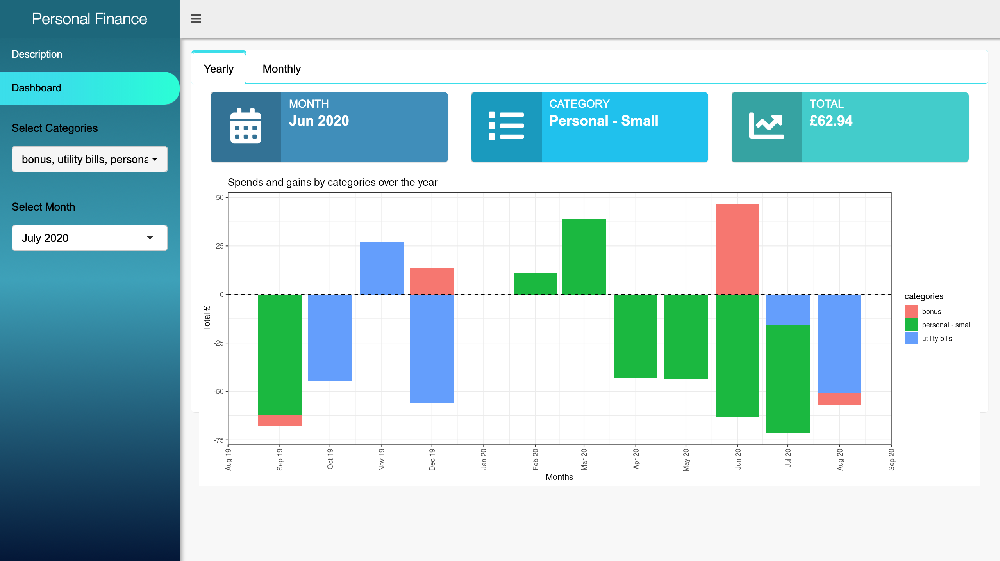
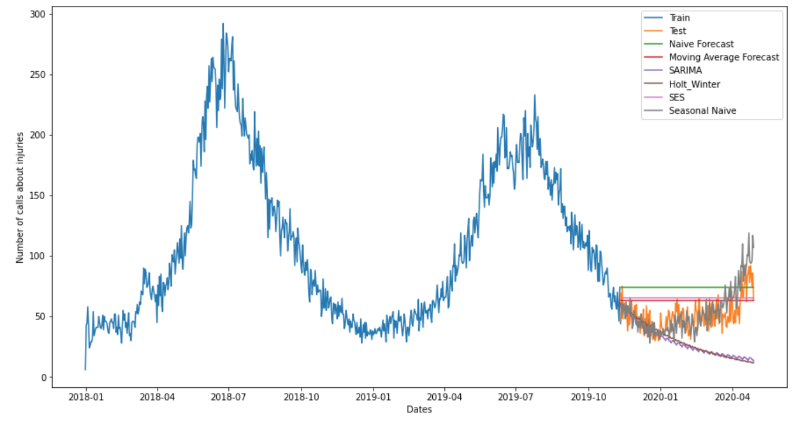
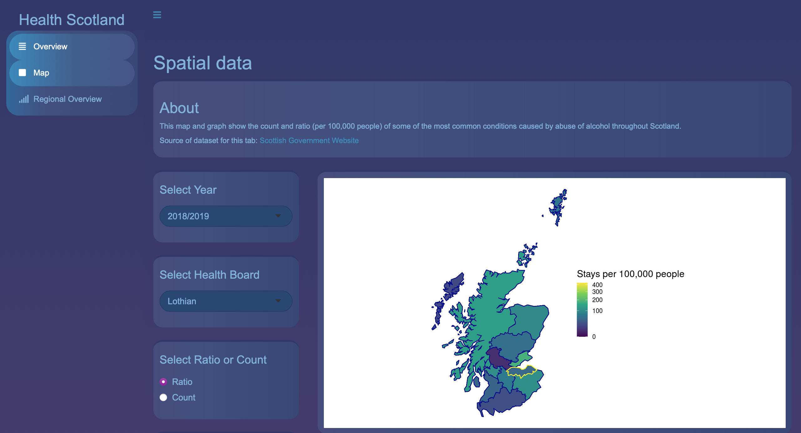

# Portfolio
## Data Analysis Projects 
Projects are presented in chronological order.
---
### Personal Finance project

After graduating with Data Analysis course from Code Clan, I have decided to do analysis over one year of my bank transactions using new tools such as **R** and **Shiny**.
The user can explore and visualise the annual spends and gains by categories and monthly spends and gains by categories. The app has info boxes which point for the month and category with the highest spend/gain and table with top spends/gains over the chosen month.

 

 

---
### Final project at CodeClan

As part of Data Analysis course at Code Clan, I had to answer the client's questions through analysing the provided data. I chose **Python** to do the analysis. The client was the UK organisation which aims to protect animals. For the project I have built up **prediction models** using simple methods and Prophet package. 

 

 

---
### Group project at CodeClan

As part of Data Analysis course, we had to create a dashboard using **R** and **Shiny** about Scotland's overall health state and particular health problem and how it changed over the last 5 - 10 years. Our particular health topic was focused on conditions that are caused by the abuse of alcohol. It shows **geographically** the difference of various rate of stays caused by different conditions related to alcohol (either mental or physical).

 

 

---
### Dirty data project at CodeClan

As part of Data Analysis course at CodeClan, I was asked to do at least 2 tasks out of 6 for the dirty data project (task 4 was mandatory). The aim of the project was to practice data cleaning skills since it is known that 80% of time in data science and analysis is spent on data cleaning.

 

---
### Meteorite analysis at CodeClan

On the 2nd weekends of Data Analysis course, I was asked to analyse data which was taken from open source NASA about meteorites that have been found up to 2013. The project can be split up into 2 sections: data cleaning up and analysis. The analysis of data was performed using **R**.

 

---

© 2021 Veronika Moroz. Powered by Jekyll and the Minimal Theme.

